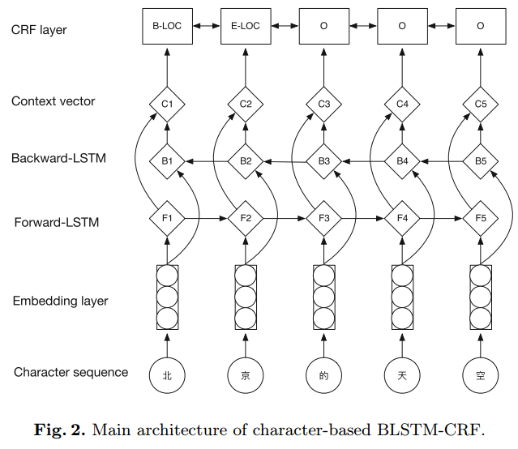
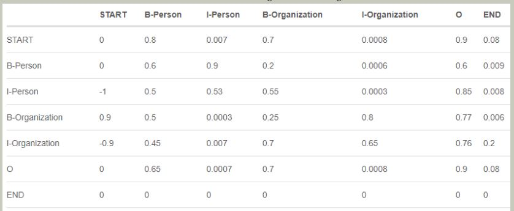
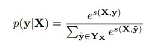
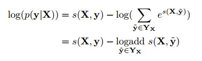
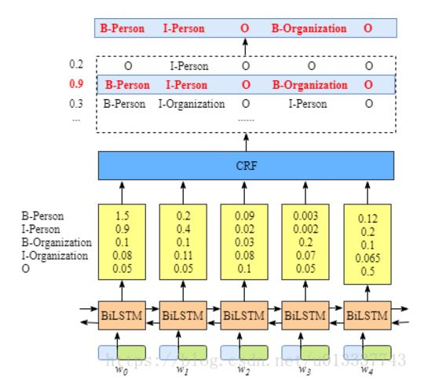
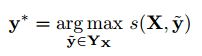

# BiLstm+CRF算法

[TOC]

## 参考文献

论文：Character-Based LSTM-CRF with Radical-Level Features for Chinese Named Entity Recognition

Github：https://github.com/crownpku/Information-Extraction-Chinese/tree/master/NER_IDCNN_CRF

https://www.cnblogs.com/dplearning/p/10060853.html

https://www.imooc.com/article/27795

## 算法是什么

BiLstem + crf模型，是目前序列标注任务中主流的深度学习框架，其中BiLSTM融合两组学习方向相反（一个按句子顺序，一个按句子逆序）的LSTM层，能够在理论上实现当前词即包含历史信息、又包含未来信息，更有利于对当前词进行标注。

主要内容分成三个部分：整体模型结构、前向传播、反向传播

【整体模型结构】

整体模型包含三层，第一层是编码层，第二层是Bilstm层，第三层是crf层

【前向传播】

数据标注采用的IOBES进行打标，I表示inside，O表示None，B表示Begin，E表示End，S表示Single

**第一层（Embedding层）：**基于中文维基百科以及京东的达人文章，采用gensim的word2vec模型进行训练，生成字向量。再将句子中的每个字由one-hot向量映射成稠密的字向量。

**第二层（BiLstm层）：**自动提取句子特征。将一个句子的各个字的char embedding序列$ (x_1,x_2,...,x_n)$作为双向LSTM各个时间步的输入，再将正向LSTM输出的隐状态序列 $(h_1⟶,h_2⟶,...,h_n⟶)$与反向LSTM的$ (h_1⟵,h_2⟵,...,h_n⟵)$在各个位置输出的隐状态进行按位置拼接 ht=[ht⟶;ht⟵]∈Rmht=[ht⟶;ht⟵]∈Rm ，得到完整的隐状态序列

**第三层（CRF层）：**使用crf层是因为LSTM是根据每个位置进行独立预测，并没有考虑位置之间标注的联系，比如B之后会再标注出一个B，而在CRF中错误是不存在的，这是因为**CRF**的特征函数的存在就是为了对给定序列观察学习各种特征（n-gram，窗口），这些特征就是在限定窗口大小下的各种词之间的关系。然后一般都会学到这样的一条规律（特征）：B后面接E，不会出现E。

定义：

**输入序列：**$X=\{x_1,x_2,x_3,...,x_n\}$

**预测序列**：$y=\{y_1,y_2,y_3,...y_n\}$

为了给标注序列进行打分，需要定义打分函数，把集合中所有打分函数对同一个标注序列的评分综合起来，就是这个标注序列最终的评分值

**定义打分函数（特征函数）：**

$s(X,y)=\sum_{i=1}^{n}A_{y_{i-1},y_i}+\sum_{i=1}^{n}P_{i,y_i}$(转移概率 + 标签输出概率)

其中，A表示(k+2)*(k+2)的转移矩阵，加2是因为要为句子首部添加一个起始状态以及为句子尾部添加一个终止状态，    表示的是从第i个标签转移到第j个标签的转移得分；

P表示Bi-LSTM网络输出的分数矩阵，大小为n*k，k是不同标签的数量，  表示将字符    分类到第j个标签的打分值

可以看出整个序列的打分等于各个位置的打分之和，而每个位置的打分由两部分得到，一部分是Bi-LSTM的分数矩阵P决定，另一部分则有CRF的转移矩阵A决定

利用softmax得到归一化后的概率：

对数似然函数：

例子：

【反向传播】

损失函数: 对下式取负然后最小化之

【预测】

使用动态规划的Viterbi算法来求解最优路径，目标找到分数最高的输出序列：

## 算法是用来解决什么问题，效果如何

bilstm+crf算法主要用于解决中文的命名识别问题

## 算法如何进行训练

## 算法的优缺点是什么

## 算法的改进方案

## 面试问题