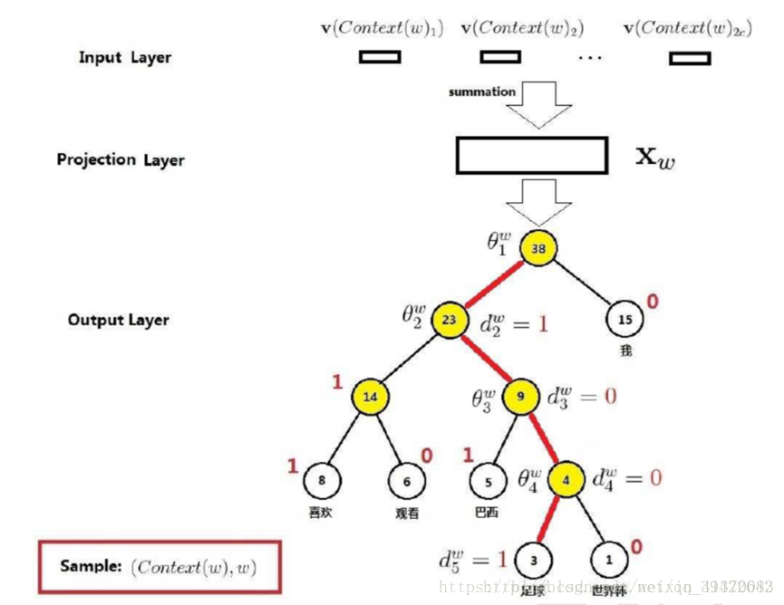
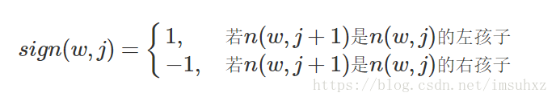

# Fasttext算法

[TOC]

## 参考文献

https://blog.csdn.net/feilong_csdn/article/details/88655927

https://blog.csdn.net/weixin_41370083/article/details/82730219

https://www.cnblogs.com/huangyc/p/9768872.html

https://www.jianshu.com/p/b1468218caf6

https://www.jiqizhixin.com/articles/2018-06-05-3

https://blog.csdn.net/imsuhxz/article/details/82115681

https://cloud.tencent.com/developer/news/288530

https://blog.csdn.net/littlely_ll/article/details/79252064

https://www.baidu.com/link?url=TWV3VimobnvT6YT4UamWa3paKP4CYX5zrtzsDghpuOZ-ObTV46MOh0KhCovg1-Sl&wd=&eqid=ce30146600049820000000035d789f4f

## 算法是什么

FastText是facebook开源的一个词向量与文本分类工具，在2016年开源，典型应用场景是“带监督的文本分类问题”。提供简单而高效的文本分类和表征学习的方法，性能比肩深度学习而且速度更快。

FastText主要有两个重要的优化：Hierarchical Softmax、N-gram。

**【整体模型架构】**

fastText模型架构和word2vec中的CBOW很相似， 不同之处是fastText预测标签而CBOW预测的是中间词，即模型架构类似但是模型的任务不同。CBOW的架构如下：

word2vec将上下文关系转化为多分类任务，进而训练逻辑回归模型，这里的类别数量|V|词库大小。通常的文本数据中，词库少则数万，多则百万，在训练中直接训练多分类逻辑回归并不现实。word2vec中提供了两种针对大规模多分类问题的优化手段， **negative sampling 和hierarchical softmax**。在优化中，negative sampling 只更新少量负面类，从而减轻了计算量。hierarchical softmax 将词库表示成前缀树，从树根到叶子的路径可以表示为一系列二分类器，一次多分类计算的复杂度从|V|降低到了树的高度

fastText模型架构：两层结构，一层隐藏层和输出层，其中$x_1,x_2,...,x_{n-1},x_n$表示一个文本中的n-gram向量，每个特征是词向量的平均值。这和前文中提到的cbow相似，cbow用上下文去预测中心词，而此处用全部的n-gram去预测指定类别。

**【前向传播】**

**输入层（N-gram特征）：**n-gram是基于语言模型的算法，基本思想是将**文本内容按照子节顺序进行大小为N的窗口滑动操作，最终形成窗口为N的字节片段序列。**而且需要额外注意一点是n-gram可以根据粒度不同有不同的含义，有字粒度的n-gram和词粒度的n-gram，下面分别给出了字粒度和词粒度的例子：

【字粒度】

我来到北京京东参观

相应的biggram特征为：我来 来到 到北 北京 京东 东参 参观

相应的trigram特征为：我来到 来到北 到北京 北京京 京京东 京东参 东参观

【词粒度】

我 来到 北京 京东 参观

相应的biggram特征为：我来到 来到北京 北京京东 京东参观

相应的trigram特征为：我来到北京 来到北京京东 北京京东参观

对于文本句子的n-gram来说，如上面所说可以是字粒度或者是词粒度，**同时n-gram也可以在字符级别工作**（仅对英文而言），例如对单个单词matter来说，假设采用3-gram特征，那么matter可以表示成图中五个3-gram特征，这五个特征都有各自的词向量，五个特征的词向量和即为matter这个词的向其中“<”和“>”是作为边界符号被添加，来将一个单词的ngrams与单词本身区分开来：

举个例子。对于一个单词“google”，为了表达单词前后边界，我们加入<>两个字符，即变形为“<google>”。假设我们希望抽取所有的tri-gram信息，可以得到如下集合：G = { <go, goo, oog,ogl, gle, le>}。在实践中，我们往往会同时提取单词的多种n-gram信息，如2/3/4/5-gram。这样，原始的一个单词google，就被一个字符级别的n-gram集合所表达。

在训练过程中，每个n-gram都会对应训练一个向量，而原来完整单词的词向量就由它对应的所有n-gram的向量求和得到。所有的单词向量以及字符级别的n-gram向量会同时相加求平均作为训练模型的输入。

从上面来看，使用n-gram有如下优点
1、**为罕见的单词或者低频的单词生成更好的单词向量**：根据上面的字符级别的n-gram来说，即是这个单词出现的次数很少，但是组成单词的字符和其他单词有共享的部分，因此这一点可以优化生成的单词向量
2、**未出现的单词**：在词汇单词中，即使单词没有出现在训练语料库中，仍然可以从字符级n-gram中构造单词的词向量
3、**n-gram可以让模型学习到局部单词顺序的部分信息,** 如果不考虑n-gram则便是取每个单词，这样无法考虑到词序所包含的信息，即也可理解为上下文信息，因此通过n-gram的方式关联相邻的几个词，这样会让模型在训练的时候保持词序信息。

但正如上面提到过，随着语料库的增加，内存需求也会不断增加，严重影响模型构建速度，针对这个有以下几种解决方案：
1、过滤掉出现次数少的单词
2、使用hash存储
3、由采用字粒度变化为采用词粒度

（hash存储）由于n-gram的量远比word大的多，完全存下所有的n-gram也不现实。Fasttext采用了Hash桶的方式，把所有的n-gram都哈希到buckets个桶中，哈希到同一个桶的所有n-gram共享一个embedding vector。（CBOW的输入是目标单词的上下文并进行one-hot编码）

**隐藏层：**由输入层**乘以权重矩阵A求和并平均**得到的。相当于将各个词向量加权求和，作为该句子的vector。（CBOW会将上下文单词向量叠加起来并经过一次矩阵乘法（线性变化）并应用激活函数）

**输出层：**由于原始的softmax需要对所有的类别概率做归一化，在类目很大的情况下，在这类别很大情况下非常耗时，因此提出了分层softmax(Hierarchical Softmax),思想是根据类别的频率构造霍夫曼树来代替标准softmax，通过分层softmax可以将复杂度从N降低到logN。

层次softmax的思想实质上是将一个**全局多分类**的问题，转化成为了**若干个二元分类问题**，从而将计算复杂度从O(V)降到O(logV)。分成两个步骤：

（1）构建哈夫曼树，首先利用所有类别及其频次构建一棵哈夫曼树，这样，不同类别作为输出时，所需要的判断次数实际上是不同的。越频繁出现的类别，离根结点越近，所需要的判断次数也越少。从而使最终整体的判断效率更高。

（2）二分类识别。每个二元分类问题，由一个基本的**逻辑回归**单元来实现。如下图所示，从根结点开始，每个中间结点（标记成灰色）都是一个逻辑回归单元，根据它的输出来选择下一步是向左走还是向右走。下图示例中实际上走了一条“左-左-右”的路线，从而找到单词w₂。而最终输出单词w₂的概率，等于中间若干逻辑回归单元输出概率的连乘积。

逻辑回归单元的公式：

  

另外一种表示：

$p(w)= \prod_{i=1}^{L(w)-1} \delta(sign(w,j) \cdot \theta_{n(w,j)}^Th)$

 其中θn(w,j)是非叶子结点n(w,j)的向量表示（即输出向量）；h是隐藏层的输出值，从输入词的向量中计算得来；sign(x,j)是一个特殊函数定义

Hierarchical Softmax的另一个替代方法叫做Noise Contrastive Estimation(NCE) 负采样

**【反向传播】**

损失函数：

哈夫曼树，又称为最优二叉树，构造流程如下：

输入：n个节点及其对应权重$\{w_1,w_2,...,w_n\}$ 

输出：对应的哈夫曼树

1. 将$\{w_1,w_2,...,w_n\}$看成由n棵仅有一个节点的树组成的森林；
2. 在森林中选择权值最小的两棵树进行合并，得到一棵新树。新树以原来两棵子树作为左右子树，并且新树根节点的权值等于左右子树的权值之和，**词频大的结点作为左孩子结点，词频小的作为右孩子结点。**；
3. 用新树替换原来森林中权值最小的那两棵树；
4. 重复步骤2和3，直到森林中仅有一棵树为止。

例子：

## 算法是用来解决什么问题

FastText是一个可以支持高效的词向量生成，以及做句子分类的工具库。

## 算法如何进行训练

## 算法在什么场景下使用，效果如何

## 算法的优缺点是什么

对比基于神经网络的分类算法相比，Fasttext有两大优点：

1、在保持高精度的情况下加快了训练速度和测试速度。由于模型简单，只有两层结构，所以训练速度非常快，在普通的CPU上可以实现分钟级别的训练，比深度模型的训练要快几个数量级。

2、不需要预训练好的词向量，fastText会自己训练词向量

## 算法的改进方案

## 面试问题

面试问题：

1.问题：FastText的层次softmax如何解释？

2.问题：FastText的输入向量一开始是怎么初始化的？

