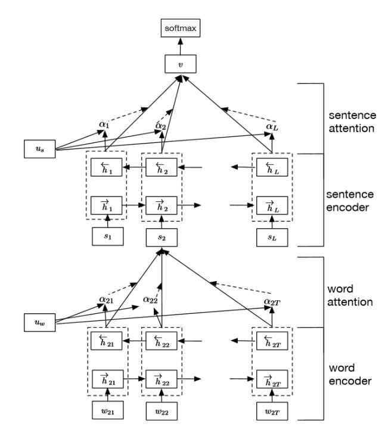

# Hierarchical Attention Network算法

[TOC]

## 参考文献

http://www.52nlp.cn/tag/textcnn

## 算法是什么

在自然语言处理中，文本分类可用于单句和多句。对于多句任务，我们称之为文档分类。词是构成句子的形式，句子是构成文件的形式。在这种情况下，可能存在一种内在的结构我们需要进行挖掘，因此提出了Hierarchical Attention Network算法

HAN算法有两个独有的特点：

1）具有能反映文档层级结构的层级结构

2）它有两个层次的注意机制用于单词和句子层面。

主要内容分成三个部分：整体模型结构、前向传播、反向传播

【整体模型结构】

整体模型包含四层，第一层是word encoder层，第二层是word attention层，第三层是sentence encoder层，第四层是sentence attention层

## 算法是用来解决什么问题

HAN算法主要用于解决文档分类

## 算法如何进行训练

## 算法在什么场景下使用，效果如何

## 算法的优缺点是什么

## 算法的改进方案

## 面试问题

