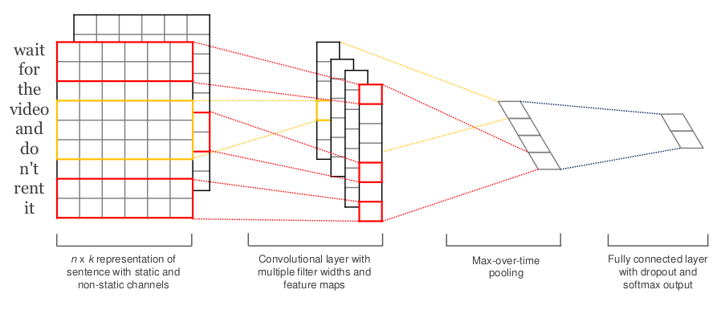
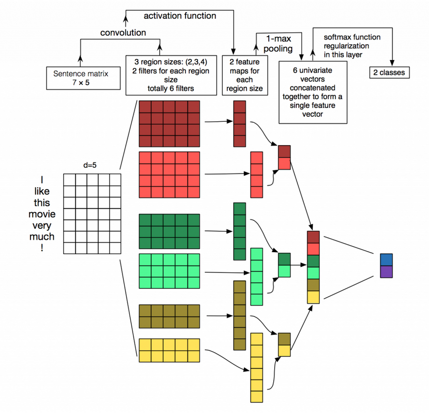
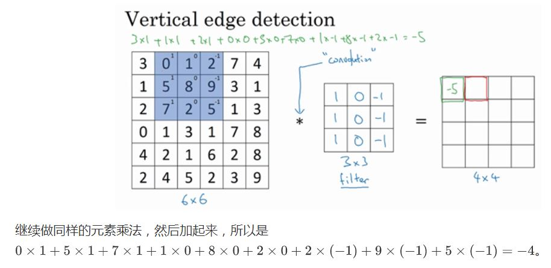

# TextCNN算法

[TOC]

## 参考文献

http://www.52nlp.cn/tag/textcnn

https://www.cnblogs.com/bymo/p/9675654.html

https://github.com/bigboNed3/chinese_text_cnn

https://blog.csdn.net/chuchus/article/details/77847476

https://github.com/brightmart/text_classification

## 算法是什么

**Yoon Kim**在论文[(2014 EMNLP) Convolutional Neural Networks for Sentence Classification](https://arxiv.org/abs/1408.5882)提出TextCNN。

将**卷积神经网络CNN**应用到**文本分类**任务，利用**多个不同size的kernel**来提取句子中的关键信息（类似于多窗口大小的ngram**）**，从而能够更好地捕捉局部相关性。

主要内容分成三个部分：整体模型结构、前向传播、反向传播

【整体模型结构】

整体模型包含四层，第一层是Embedding层，第二层是Convolution层，第三层MaxPooling层，第四层是全连接的softmax层。



【前向传播】




**第一层（Embedding层）**：第一层是图中最左边的7乘5的句子矩阵，每行是词向量，维度=5，这个可以类比为图像中的原始像素点

词向量的表示是方式

- **数据量较大**：可以直接随机初始化embeddings，然后基于语料通过训练模型网络来对embeddings进行更新和学习。

- **数据量较小**：可以利用外部语料来预训练(pre-train)词向量，然后输入到Embedding层，用预训练的词向量矩阵初始化embeddings。（通过设置weights=[embedding_matrix]）。

- - **静态(static)方式**：训练过程中不再更新embeddings。实质上属于迁移学习，特别是在目标领域数据量比较小的情况下，采用静态的词向量效果也不错。（通过设置trainable=False）
  - **非静态(non-static)方式**：在训练过程中对embeddings进行更新和微调(fine tune)，能加速收敛。（通过设置trainable=True）

**第二层（卷积层）：**经过 kernel_sizes=(2,3,4) 的一维卷积层，每个kernel_size 有两个输出 channel（有三种卷积，2X5，3X5，4X5，一共6个卷积核，生成维度为7-size +1 ）

**文本是一维数据，因此在TextCNN卷积用的是一维卷积**（在**word-level**上是一维卷积；虽然文本经过词向量表达后是二维数据，但是在embedding-level上的二维卷积没有意义）。一维卷积带来的问题是需要**通过设计不同 kernel_size 的 filter 获取不同宽度的视野**

**第三层（MaxPolling层）：**1-max pooling层，这样不同长度句子经过pooling层之后都能变成定长的表示。

**最后一层（全连接的softmax层）：**接一层全连接的 softmax 层，输出每个类别的概率


卷积计算：




## 算法是用来解决什么问题

## 算法在什么场景下使用，效果如何

| Model    | fastText | TextCNN | TextRNN | RCNN  | HierAtteNet | Seq2seqAttn | EntityNet | DynamicMemory | Transformer |
| -------- | -------- | ------- | ------- | ----- | ----------- | ----------- | --------- | ------------- | ----------- |
| Score    | 0.362    | 0.405   | 0.358   | 0.395 | 0.398       | 0.322       | 0.400     | 0.392         | 0.322       |
| Training | 10m      | 2h      | 10h     | 2h    | 2h          | 3h          | 3h        | 5h            | 7h          |

(mulit-label label prediction task,ask to prediction top5, 3 million training data,full score:0.5)

## 算法的优缺点是什么

**TextCNN模型最大的问题也是这个全局的max pooling丢失了结构信息，因此很难去发现文本中的转折关系等复杂模式，**TextCNN只能知道哪些关键词是否在文本中出现了，以及相似度强度分布，而不可能知道哪些关键词出现了几次以及出现这些关键词出现顺序。假想一下如果把这个中间结果给人来判断，人类也很难得到对于复杂文本的分类结果，所以机器显然也做不到。**针对这个问题，可以尝试k-max pooling做一些优化，k-max pooling针对每个卷积核都不只保留最大的值**，他保留前k个最大值，并且保留这些值出现的顺序，也即按照文本中的位置顺序来排列这k个最大值。在某些比较复杂的文本上相对于1-max pooling会有提升。

例子：

```
“我觉得这个地方景色还不错，但是人也实在太多了”
```

虽然前半部分体现情感是正向的，全局文本表达的是偏负面的情感，利用 k-max pooling能够很好捕捉这类信息


## 算法的改进方案

使用k-max pooling替换1-max pooling

## 面试问题