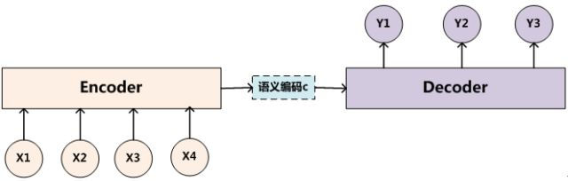
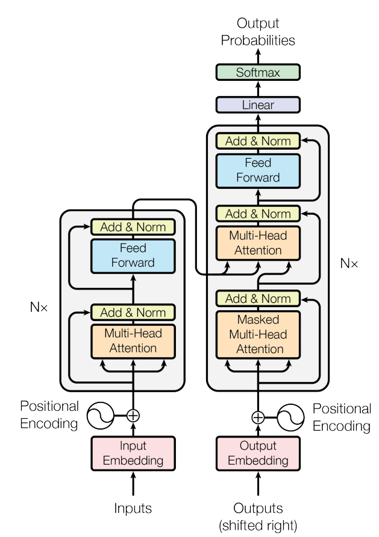
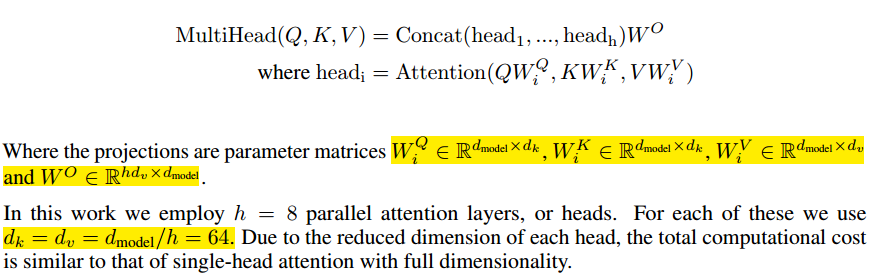
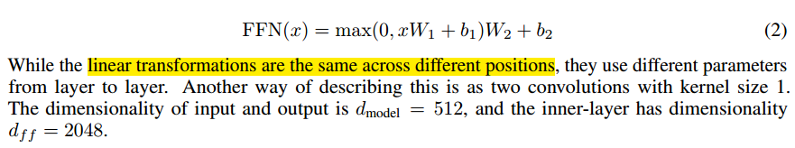

# Transfomer算法

[TOC]

## 参考文献

https://www.jianshu.com/p/ef41302edeef

https://ai.googleblog.com/2017/08/transformer-novel-neural-network.html

http://nlp.seas.harvard.edu/2018/04/03/attention.html

https://zhuanlan.zhihu.com/p/49271699

## 算法是什么

Transomer 是完全基于注意力机制的支持并行化的Encoder-Decoder框架

【整体架构】

编码器将符号表示的输入序列（x1,..., xn）映射到连续表示序列z =（z1,....,zn）。 给定z，然后解码器一次一个元素地生成符号的输出序列（y1,...,ym）。 在每个步骤中，模型都是自回归的[10]，在生成下一个时使用先前生成的符号作为附加输入。

Transformer遵循这种整体架构，使用堆叠的**self-attention和point-wise**，完全连接的层用于**编码器和解码器（Transformer仍然属于encoder-decoder框架）**，分别如图1的左半部分和右半部分所示。

【位置编码层】

【多头注意力】

注意力机制：通过评估目标句子中的每个单词应该分配多少注意力到源句子中每个单词，计算对应的权重，即相关性得分，然后对value进行加权求和，求得最终的attention值

注意力计算的三个阶段：**计算相关性，归一化，加权求和**。**第一个过程是根据Query和Key计算权重系数，第二个过程根据权重系数对Value进行加权求和。而第一个过程又可以细分为两个阶段：第一个阶段根据Query和Key计算两者的相似性或者相关性；第二个阶段对第一阶段的原始分值进行归一化处理**；如下图所示：

**加入缩放因子，构建Scaled Dot-Product Attention（缩放点乘注意力)**：

和点积注意力不同的地方，在于这里加入了缩放因子 ，之所以用点积注意力，是因为它可以使用高度优化的矩阵乘法代码实现，在实践中更快，更省空间。但点积注意力有个问题就是，**当维度很大时，点积值会大幅度增大**，将softmax函数推向其所具有的区域极小的渐变，为了抵消这种影响，这里运用了缩放因子来缩放点积，公式如下：

$Attention(Q,K,V)=softmax(\frac{QK^T}{\sqrt{d_k}})V$

**（多头注意力机制）与其使用dmodel维度的键，值和查询来执行单个注意函数，不如将查询，键和值h次分别用不同线性投影投影到dk，dk和dv维度是有益的。 然后，在这些投影版本的查询，键和值中，我们并行执行注意功能，产生dv维度输出值**。 这些连接并再次投影，得到最终值

**多头注意力允许模型联合关注来自不同位置的不同表示子空间的信息。 平均会抑制只有一个注意力头的情况**。

**相当于将一个attention的计算，拆分成8份，然后并行计算，再将结果进行合并**

【前馈网络】

除了注意力子层之外，我们的**编码器和解码器**中的每个层都包含一个**完全连接的前馈网络**，该网络分别和相同地应用于每个位置。 这包括两个线性变换，其间有ReLU激活。

虽然线性变换在不同位置上是相同的，但它们在层与层之间使用不同的参数。 描述这种情况的另一种方式是两个内核大小为1的卷积。输入和输出的维度是dmodel = 512，内层的维度dff = 2048。

【编码层】

编码器由一堆N = 6个相同的层组成。 每层有两个子层。 第一层是**多头自我关注机制**，第二层是简单的，**位置完全连接的前馈网络**。 我们在两个子层中的每一个周围使用**残差连接（residual connection）**[11]，然后是层归一化[1]。 也就是说，每个子层的输出是**LayerNorm（x + Sublayer（x））**，其中Sublayer（x）是由子层本身实现的功能。 为了促进这些残差连接，模型中的所有子层以及嵌入层产生维度**dmodel = 512**的输出。

【解码层】

这里同样是有六个相同的层组成，但是这里的layer 和encoder 不一样， 这里的layer 包含了三个sub-layers,  第一层是**masked multi-head attention layer**, 第二层是**encoder-decoder attention layer**， 最后一层是**全连接层**。 前两个sub-layer 都是基于multi-head attention layer.  这里有个特别点就是masking,  **masking 的作用就是防止在训练的时候 使用未来的输出的单词。 比如训练时， 第一个单词是不能参考第二个单词的生成结果的。** Masking就会把这个信息变成0， 用来保证预测位置 i 的信息只能基于比 i 小的输出**（6层组合，每一层有三个子层，包括masked multi-head attention layer、encoder-decoder attention layer，全连接的前馈网络）**

## 算法是用来解决什么问题

## 算法如何进行训练

## 算法在什么场景下使用，效果如何

## 算法的优缺点是什么

## 算法的改进方案

## 面试问题