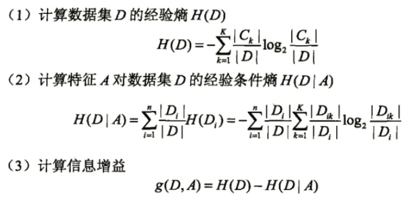
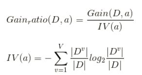
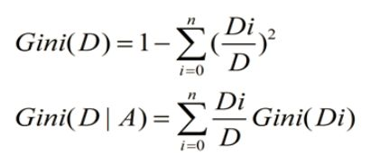

# 决策树

[TOC]

## 参考文献

https://zhuanlan.zhihu.com/p/34534004?utm_source=wechat_session&utm_medium=social&utm_oi=1041629262821994496&from=singlemessage&isappinstalled=0&wechatShare=1&s_r=0

https://blog.csdn.net/choven_meng/article/details/82878018#3%E3%80%81CART%E7%AE%97%E6%B3%95

## 算法是什么

决策树是一个有监督的分类与回归模型，其本质是选择一个能带来最大信息增益的特征值进行树的分割，直到到达结束条件或者叶子结点纯度到达一定阈值。

决策树学习通过包括3个步骤：特征选择、决策树的生成和决策树的修剪

主要算法：ID3、C4.5以及CART算法

【预备知识】

信息熵：表示随机变量不确定性的度量，信息熵越大，随机变量的不确定性就越大

自信息：假设随机事件$w_n$发生的概率是$P(w_n)$，则该事件一旦发生其信息量就定义为：

​				$I(w_n)=log(\frac{1}{P(w_n)})=-log(P(w_n))$

随机变量x的熵定义为：$H(x)=-\sum_{i=1}^{n}p_ilogp_i$

**【特征选择】**

特征选择在于选择对训练数据具有分类能力的特征，这样可以提高决策树的学习效率，通常特征选择的准则是信息增益、信息增益比、基尼系数。

**信息增益**：集合D的经验熵H(D)与特征A给定条件下D的经验条件熵$H(D|A)$之差，即：$g(D,A)=H(D)-H(D|A)$

对训练数集D，计算每个特征的信息增益，并比较他们的大小，选择信息增益最大的特征

输入：训练数据集D和特征A；

输出：特征A对训练数据集D的信息增益g(D,A)

该算法存在一定缺陷：假设每个记录有一个属性“ID”，若按照ID来进行分割的话，由于ID是唯一的，因此在这一个属性上，能够取得的特征值等于样本的数目，也就是说ID的特征值很多。那么无论以哪个ID为划分，叶子结点的值只会有一个，纯度很大，得到的信息增益会很大，但这样划分出来的决策树是没意义的。由此可见，**ID3决策树偏向于取值较多的属性进行分割，存在一定的偏好**

**信息增益比：**信息增益比率通过引入一个被称作分裂信息(Split information)的项来惩罚取值较多的属性

上式，分子计算与ID3一样，分母是由属性A的特征值个数决定的，个数越多，IV值越大，信息增益率越小，这样就可以避免模型偏好特征值多的属性，但是聪明的人一看就会发现，如果简单的按照这个规则来分割，模型又会偏向特征数少的特征。因此C4.5决策树先从候选划分属性中找出**信息增益高于平均水平**的属性，在从中选择**增益率最高**的。

基尼系数（分类）：

基尼系数（回归，均方差）：

​                                        $Gini(D|A) = \sum{\sigma_i}=\sum{\sqrt{\sum{(x_i-\mu)^2}}}=\sum{\sqrt{\sum{x_i}-n\mu^2}}$

Gini(D)反映了数据集D的纯度，值越小，纯度越高。我们在候选集合中选择使得划分后基尼指数最小的属性作为最优化分属性。

【决策树生成】

提到决策树算法，很多想到的就是上面提到的ID3、C4.5、CART分类决策树。其实决策树分为分类树和回归树，前者用于分类，如晴天/阴天/雨天、用户性别、邮件是否是垃圾邮件，后者用于预测实数值，如明天的温度、用户的年龄等。

作为对比，先说分类树，我们知道ID3、C4.5分类树在每次分枝时，是穷举每一个特征属性的每一个阈值，找到使得按照feature<=阈值，和feature>阈值分成的两个分枝的熵最大的feature和阈值。按照该标准分枝得到两个新节点，用同样方法继续分枝直到所有人都被分入性别唯一的叶子节点，或达到预设的终止条件，若最终叶子节点中的性别不唯一，则以多数人的性别作为该叶子节点的性别。

回归树总体流程也是类似，不过在每个节点（不一定是叶子节点）都会得一个预测值，以年龄为例，该预测值等于属于这个节点的所有人年龄的平均值。分枝时穷举每一个feature的每个阈值找最好的分割点，但衡量最好的标准不再是最大熵，而是最小化均方差--即（每个人的年龄-预测年龄）^2 的总和 / N，或者说是每个人的预测误差平方和 除以 N。这很好理解，被预测出错的人数越多，错的越离谱，均方差就越大，通过最小化均方差能够找到最靠谱的分枝依据。分枝直到每个叶子节点上人的年龄都唯一（这太难了）或者达到预设的终止条件（如叶子个数上限），若最终叶子节点上人的年龄不唯一，则以该节点上所有人的平均年龄做为该叶子节点的预测年龄。

**对回归树用平方误差最小化准则，对分类树用基尼指数最小化准则**

## 算法是用来解决什么问题

## 算法如何进行训练

## 算法在什么场景下使用，效果如何

## 算法的优缺点是什么

## 算法的改进方案

## 面试问题