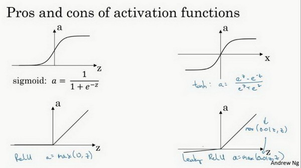

# 吴恩达深度学习的数学推导

[TOC]

## 前言

本文章主要针对吴恩达的深度学习视频中的数据推导进行总结，以便以后面试使用。相关的公式内容按照视频内容进行划分，方便快速查找。

参考内容：[吴恩达深度学习笔记](http://www.ai-start.com/dl2017/)

## 第二周：神经网络的编程基础

符号定义：

${x}$：表示一个${n_x}$维数据，为输入数据，维度为${(n_x,1)}$； 

${y}$：表示输出结果，取值为${(0,1)}$；

${}$${(x^{(i)},y^{(j)})}$：表示第${i}$组数据，可能是训练数据，也可能是测试数据，此处默认为训练数据； 

${X=[x^{(1)},x^{(2)},...,x^{(m)}]}$：表示所有的训练数据集的输入值，放在一个 ${n_x \times m}$的矩阵中，其中表示样本数目; 

${Y=[y^{(1)},y^{(2)},...,y^{(m)}]}$：对应表示所有训练数据集的输出值，维度为${1 \times m}$。

用一对${(x,y)}$来表示一个单独的样本，${x}$代表${n_x}$维的特征向量，${y}$ 表示标签(输出结果)只能为0或1。 而训练集将${m}$由个训练样本组成，其中${(x^{(1)},y^{(1)})}$表示第一个样本的输入和输出，${(x^{(2)},y^{(2)})}$表示第二个样本的输入和输出，直到最后一个样本，然后所有的这些一起表示整个训练集。有时候为了强调这是训练样本的个数，会写作${M_{train}}$，当涉及到测试集的时候，我们会使用${M_{test}}$来表示测试集的样本数。

定义一个矩阵大写${X}$来表示训练集，由输入向量${x^{(1)}}$、${x^{(2)}}$等组成。我们把${x^{(1)}}$作为第一列放在矩阵中，${x^{(2)}}$作为第二列，${x^{(m)}}$放到第${m}$列，然后得到训练集矩阵${X}$。

#### **逻辑回归小型的神经网络**

逻辑回归的输出函数：
$$
\hat{y}=\sigma(w^Tx+b),where \sigma(z)=\frac{1}{1+e^{-z}}
$$
逻辑回归的损失函数：
$$
L(\hat{y},y)=-ylog(\hat{y})-(1-y)log(1-\hat{y})
$$
当$${y=1}$$时损失函数$${L=-log(\hat{y})}$$，如果想要损失函数$${L}$$尽可能得小，那么$${\hat{y}}$$就要尽可能大，因为**sigmoid**函数取值$${[0,1]}$$，所以$$\hat{y}$$会无限接近于1。当$${y=0}$$时损失函数$${L=-log(1-\hat{y})}$$，如果想要损失函数${L}$尽可能得小，那么$${\hat{y}}$$就要尽可能小，因为**sigmoid**函数取值$${[0,1]}$$，所以会无限接近于0。

逻辑回归的整体损失函数：
$$
J(w,b)=\frac{1}{m}\sum_{i=1}^{m}L(\hat{y}^{(i)},y^{(i)})
=\frac{1}{m}\sum_{i=1}^{m}(-y^{(i)}log(\hat{y}^{(i)})-(1-y^{(i)})log(1-\hat{y}^{(i)}))
=-\frac{1}{m}\sum_{i=1}^{m}(y^{(i)}log(\hat{y}^{(i)})+(1-y^{(i)})log(1-\hat{y}^{(i)}))
$$
目标找到合适的w和b，来让损失函数${J}$的总代价降到最低。

#### **梯度下降法**

整个梯度下降法的迭代过程就是不断地朝着最小值点的方向走
$$
w := w-\alpha\frac{\partial J(w,b)}{\partial w}
b := b - \alpha\frac{\partial J(w,b)}{\partial b}
$$
${\partial}$表示求偏导符号，${\frac{\partial J(w,b)}{\partial w}}$ 就是函数${J(w,b)}$ 对${w}$ 求偏导，在代码中我们会使用${\mathrm{d}w}$表示这个结果，${\frac{\partial J(w,b)}{\partial w}}$就是函数${J(w,b)}$ 对${b}$求偏导，在代码中我们会使用${\mathrm{d}b}$表示这个结果， 小写字母${d}$用在求导数（**derivative**），即函数只有一个参数， 偏导数符号${\partial }$用在求偏导（**partial derivative**），即函数含有两个以上的参数。

#### **使用计算图求导数**

导数计算：

${dv=\frac{dJ}{dv}=3}$     

${da = \frac{dJ}{da}=\frac{dJ}{dv}\frac{dv}{da}=3}$        

${du = \frac{dJ}{du}=\frac{dJ}{dv}\frac{dv}{du}=3}$

${{db = \frac{dJ}{db}=\frac{dJ}{du}\frac{du}{db}=6}}$        

${{{dc = \frac{dJ}{dc}=\frac{dJ}{du}\frac{du}{dc}=9}}}$

#### **逻辑回归的单例反向传播**

导数计算：

${da=\frac{dL}{da}=-\frac{y}{a}+\frac{1-y}{1-a}}$     

${dz = \frac{dL}{dz}=\frac{dL}{da}\frac{da}{dz}=(-\frac{y}{a}+\frac{1-y}{1-a})a(1-a)}=a-y$    

${dw_1= \frac{dL}{dw_1}=\frac{dL}{dz}\frac{dz}{dw_1}=dz\cdot x_1}$    

${dw_2= \frac{dL}{dw_2}=\frac{dL}{dz}\frac{dz}{dw_2}=dz\cdot x_2}$

${db= \frac{dL}{db}=\frac{dL}{dz}\frac{dz}{db}=dz}$

${w_1 = w_1 - \alpha dw_1}$

${w_2 = w_2 - \alpha dw_2}$

${b = b - \alpha db}$

#### 向量化逻辑回归的反向传播

${Z=w^{T}X+b=np.dot(w.T,X)+b}$

${A=\sigma{Z}}$     

${dZ=A-Y}$

${dw=\frac{1}{m}*X*dz^{T}}$

${db=\frac{1}{m}*np.sum(dZ)}$

${w=w-\alpha dw}$

${b=b-\alpha db}$

numpy的广播机制：如果两个数组的后缘维度的轴长度相符或其中一方的轴长度为1，则认为它们是广播兼容的。广播会在缺失维度和轴长度为1的维度上进行

#### logistic损失函数的解释

如果y=1，在给定训练样本x条件下${y=\hat{y}}$；反过来说，如果y=0，在给定训练条件x条件下${y=1-\hat{y}}$，即

由于这是二分类问题的损失函数，y的取值只能是0或者1。因此合成一个公式如下：

​                                          ${p(y|x)=\hat{y}^y(1-\hat{y})^{(1-y)}}$

由于log函数是严格单调递增的函数，最大化${log(p(y|x))}$等价于最大化${p(y|x)}$,因此：

​                                         ${log(p(y|x))=log(\hat{y}^y(1-\hat{y})^{(1-y)})}$

​                                                               ${=ylog\hat{y}+(1-y)log(1-\hat{y})}$

​                                                               ${=-L(\hat{y},y)}$

最小化损失函数等价于最大化${p(y|x)}$

## 第三周：浅层神经网络

逻辑回归模型：

${z=w^Tx + b}$  ==>   ${a = \sigma{(z)}}$  ==>  ${L(a,y)}$ 

#### 神经网络的表示

当我们计算网络的层数时，输入层是不算入总层数内，所以隐藏层是第一层，输出层是第二层。

其中，x表示输入特征，a表示每个神经元的输出，W表示特征的权重，上标表示神经网络的层数（隐藏层为1），下标表示该层的第几个神经元。这是神经网络的符号惯例。

给定输入单个样本x：

${z^{[1]}=W^{[1]}x+b^{[1]}}$

${a^{[1]}=\sigma{(z^{[1]})}}$

${z^{[2]}=W^{[2]}a^{[1]}+b^{[2]}}$

${a^{[2]}=\sigma{(z^{[2]})}}$

向量化表示：

${Z^{[1]}=W^{[1]}X+b^{[1]}}$

${A^{[1]}=\sigma{(Z^{[1]})}}$

${Z^{[2]}=W^{[2]}A^{[1]}+b^{[2]}}$

${A^{[2]}=\sigma{(Z^{[2]})}}$

#### 激活函数

使用一个神经网络时，需要决定使用哪种激活函数用隐藏层上，哪种用在输出节点上。

- **tanh函数（双曲正切函数）**

  tanh函数，是sigmoid的向下平移和伸缩的结果，整体效果也要优于sigmoid函数。

  公式：$a=tanh(z)=\frac{e^z-e^{-z}}{e^z+e^{-z}}$

​        值域：位于+1与-1之间

​		**sigmoid**函数和**tanh**函数两者共同的缺点是，在特别大或者特别小的情况下，导数的梯度或者函数的斜率会变得特别小，最后就会接近于0，导致降低梯度下降的速度。

- **Relu函数（修正线性单元的函数）**

  公式：${a=max(0,z)}$ 

  只要是正值的情况下，导数恒等于1，当是负值的时候，导数恒等于0。从实际上来说，当使用的导数时，=0的导数是没有定义的。但是当编程实现的时候，的取值刚好等于0.00000001，这个值相当小，所以，在实践中，不需要担心这个值，是等于0的时候，假设一个导数是1或者0效果都可以

- **LeakyReLu函数**

​       公式：${a=max(0,01,z)}$  

​	   当是负值时，这个函数的值不是等于0，而是轻微的倾斜

Relu与LeakyRelu的优点：

第一，在的区间变动很大的情况下，激活函数的导数或者激活函数的斜率都会远大于0，在程序实现就是一个**if-else**语句，而**sigmoid**函数需要进行浮点四则运算，在实践中，使用**ReLu**激活函数神经网络通常会比使用**sigmoid**或者**tanh**激活函数学习的更快。

第二，**sigmoid**和**tanh**函数的导数在正负饱和区的梯度都会接近于0，这会造成梯度弥散，而**Relu**和**Leaky ReLu**函数大于0部分都为常数，不会产生梯度弥散现象。(同时应该注意到的是，**Relu**进入负半区的时候，梯度为0，神经元此时不会训练，产生所谓的稀疏性，而**Leaky ReLu**不会有这问题)。

z在**ReLu**的梯度一半都是0，但是，有足够的隐藏层使得z值大于0，所以对大多数的训练数据来说学习过程仍然可以很快。

总结：如果输出是0、1值（二分类问题），则输出层选择**sigmoid**函数，然后其它的所有单元都选择**Relu**函数，这是很多激活函数的默认选择，如果在隐藏层上不确定使用哪个激活函数，那么通常会使用**Relu**激活函数。有时，也会使用**tanh**激活函数

总结2：**sigmoid**激活函数：除了输出层是一个二分类问题基本不会用它。**tanh**激活函数：**tanh**是非常优秀的，几乎适合所有场合。**ReLu**激活函数：最常用的默认函数，如果不确定用哪个激活函数，就使用**ReLu**或者**Leaky ReLu**。

通常的建议是：如果不确定哪一个激活函数效果更好，可以把它们都试试，然后在验证集或者发展集上进行评价。然后看哪一种表现的更好，就去使用它。

#### 为什么需要非线性激活函数

如果不使用非线性的激活函数，那么神经网络只是把输入线性组合在输出，没有办法设计出有趣的函数。事实证明如果你在隐藏层用线性激活函数，在输出层用sigmoid函数，那么这个模型的复杂度和没有任何隐藏层的标准Logistic回归是一样的。

总而言之，不能在隐藏层用线性激活函数，可以用**ReLU**或者**tanh**或者**leaky ReLU**或者其他的非线性激活函数，唯一可以用线性激活函数的通常就是输出层；除了这种情况，会在隐层用线性函数的，除了一些特殊情况，比如与压缩有关的，那方面在这里将不深入讨论。在这之外，在隐层使用线性激活函数非常少见。因为房价都是非负数，所以我们也可以在输出层使用**ReLU**函数这样你的${\hat{y}}$ 都大于等于0。

#### 激活函数的导数

在神经网络中使用反向传播的时候，你真的需要计算激活函数的斜率或者导数。针对以下四种激活，求其导数如下：

（1）sigmoid函数

公式：$\frac{dg(z)}{dz}=\frac{1}{1+e^{-z}}(1-\frac{1}{1+e^{-z}})=g(z)(1-g(z))$

推导过程：

注：

当$z=10$或${z=-10}$ ， $\frac{dg(z)}{dz}\approx 0$

当$z=0$，$\frac{dg(z)}{dz}=g(z)(1-g(z))=1/4$

在神经网络中，$a=g(z);g(z)'=g(z)(1-g(z))$

（2）Tanh函数

公式：$g(z)'=1-(tanh(x))^2$

推导过程：

注：

当$z=10$或$z=-10$ ，  $\frac{dg(z)}{dz}\approx 0$

当$z=0$， $\frac{dg(z)}{dz}=1-0=1$

（3）Relu函数

公式：

注：通常在$z=0$的时候给定其导数1，0； 当然$z=0$的情况很少

（4）Leaky Relu

公式：

注：通常在$z=0$的时候给定其导数1，0； 当然$z=0$的情况很少

#### 直观理解反向传播

正向传播：

反向传播：

#### 随机初始化

对于一个神经网络，如果你把权重或者参数都初始化为0，那么梯度下降将不会起作用

应该对参数进行随机初始化：

选择0.01的原因，权重w不能很大，因为w很大，会让z变得很大，从而使得tanh/sigmoid激活函数停留在平坦的地方，导致梯度下降的很慢。

## 第四周： 深层神经网络

#### 深层神经网络

神经网络的定义：从左到有，由0开始定义。

左图为3层网络，包含两个隐藏层，右图为6层网络，包含5个隐藏层

#### 前向传播和反向传播

前向传播：

$z^{[l]}=W^{[l]} \cdot A^{[l-1]} + b^{[l]}$

$A^{[l]}=g^{[l]}(Z^{[l]})$

前向传播需要输入${A^{[0]}}$也就是${X}$来初始化，初始化的是第一层的输入值。${a^{[0]}}$对应于一个训练样本的输入特征，而${A^{[0]}}$对应于一整个训练样本的输入特征，所以这就是这条链的第一个前向函数的输入，重复这个步骤就可以从左到右计算前向传播。

后向传播：

${dZ^{[l]}=dA^{[l]}*g^{[l]'}(Z^{[l]})}$

$dW^{[[l]]}=\frac{1}{m}dZ^{[l]} \cdot A^{[l-1]T}$

${db^{[l]}=\frac{1}{m}np.sum(dz^{[l]},axis=1,keepdims=True)}$

$dA^[l-1]=W^{[l]T}\cdot dZ^{[l]}$

总结一下：

第一层你可能有一个**ReLU**激活函数，第二层为另一个**ReLU**激活函数，第三层可能是**sigmoid**函数（如果你做二分类的话），输出值为，用来计算损失；这样你就可以向后迭代进行反向传播求导来求${dw^{[3]}}$，${db^{[3]}}$ ，${dw^{[2]}}$，${db^{[[2]]}}$  ，${dw^{[1]}}$，${db^{[[1]]}}$ 。在计算的时候，缓存会把 ${z^{[1]}z^{[2]}z^{[3]}}$传递过来，然后回传${da^{[2]}}$， ${da^{[1]}}$，可以用来计算${da^{[0]}}$，但我们不会使用它，这里讲述了一个三层网络的前向和反向传播，还有一个细节没讲就是前向递归——用输入数据来初始化，那么反向递归（使用**Logistic**回归做二分类）——对 求导。

忠告：补补微积分和线性代数，多推导，多实践。

#### 核对矩阵的维数(重要)

常用的检查代码是否有错的方法就是拿出一张纸过一遍算法中矩阵的维数。

w的维度是$w^{[l]}:(n^{[l]},n^{[l-1]})$（下一层的维数，前一层的维数）

b的维度是$b^{[l]}:(n^{[l]},1)$  （下一层的维数，1）

z、a的维度是$z^{[l]},a^{[l]}:(n^{[l]},1)$

$dw^{[l]}$和$w^{[l]}$维度相同，$db^{[l]}$和$b^{[l]}$维度相同，且w和b向量化维度不变，但z，a以及x的维度会向量化后发生变化。

向量化后：

$Z^{[l]}$可以看成由每一个单独的叠加而得到，$Z^{[l]}=(z^{[l][1]},z^{[l][2]},z^{[l][3]},...,z^{[l][m]})$，

m为训练集大小，所以$Z^{[l]}$维度不再是$(n^{[l]},1)$，而是$(n^{l},m)$。

$A^{[l]}$：$(n^{[l]},m)$，$A^{[0]}=X=(n^{[l]},m)$

#### 为什么使用深层表示

small：隐藏单元的数量相对较少

deep：隐藏层数目比较多

很多数据函数用深度网络计算比浅网络要容易德多，这就是为什么需要深层的网络

#### 搭建神经网络块

正向传播：把输入特征$a^{[0]}$，放入第一层并计算第一层的激活函数，用$a^{[1]}$表示，你需要$W^{[1]}$和来$b^{[1]}$计算，之后也缓存$z^{[1]}$值。之后喂到第二层，第二层里，需要用到$W^{[2]}和$$b^{[2]}$，你会需要计算第二层的激活函数$a^{[2]}$。后面几层以此类推，直到最后你算出了，第$L$层的最终输出值$\hat{y}$ 。在这些过程里我们缓存了所有的$z$值，这就是正向传播的步骤。

反向传播（存在疑问）：通过${\hat{y}}$计算出${da^{[l]}}$, 再根据缓存${z^{[l]}}$计算出${dz^{[l]}}$

${dZ^{[l]}=dA^{[l]}*g^{[l]'}(Z^{[l]})}$

$dW^{[[l]]}=\frac{1}{m}dZ^{[l]} \cdot A^{[l-1]T}$

${db^{[l]}=\frac{1}{m}np.sum(dz^{[l]},axis=1,keepdims=True)}$

$dA^[l-1]=W^{[l]T}\cdot dZ^{[l]}$

参数更新：$W = W-\alpha dW$, $b=b-\alpha db$

#### 参数VS超参数

什么是超参数？

比如算法中的**learning rate** （学习率）、**iterations**(梯度下降法循环的数量)、$L$（隐藏层数目）、$n^{[l]}$（隐藏层单元数目）、**choice of activation function**（激活函数的选择）都需要你来设置，这些数字实际上控制了最后的参数$W$和$b$的值，所以它们被称作超参数。

如何寻找超参数的最优值？（AutoML方法）

走**Idea—Code—Experiment—Idea**这个循环，尝试各种不同的参数，实现模型并观察是否成功，然后再迭代。

在前面几页中，还有很多不同的超参数。然而，当你开始开发新应用时，预先很难确切知道，究竟超参数的最优值应该是什么。所以通常，你必须尝试很多不同的值，并走这个循环，试试各种参数。试试看5个隐藏层，这个数目的隐藏单元，实现模型并观察是否成功，然后再迭代。这页的标题是，应用深度学习领域，一个很大程度基于经验的过程，凭经验的过程通俗来说，就是试直到你找到合适的数值。

#### 深度学习和大脑的关联性

## 第五周：深度学习的实践层面

#### 训练验证测试集（Train / Dev/ Test sets)

在配置训练、验证和测试数据集的过程中做出正确决策会在很大程度上帮助大家创建高效的神经网络。训练神经网络时，我们需要做出很多决策，例如：

1.神经网络分多少层

2.每层含有多少个隐藏单元

3.学习速率是多少

4.各层采用哪些激活函数

从一个领域或者应用领域得来的直觉经验，通常无法转移到其他应用领域，最佳决策取决于你所拥有的数据量，计算机配置中输入特征的数量，用**GPU**训练还是**CPU**，**GPU**和**CPU**的具体配置以及其他诸多因素。

对于很多应用系统，即使是经验丰富的深度学习行家也不太可能一开始就预设出最匹配的超级参数，所以说，应用深度学习是一个典型的迭代过程，需要多次循环往复，才能为应用程序找到一个称心的神经网络，因此循环该过程的效率是决定项目进展速度的一个关键因素，而创建高质量的训练数据集，验证集和测试集也有助于提高循环效率。

在机器学习发展的小数据量时代，常见做法是将所有数据三七分，就是人们常说的70%验证集，30%测试集，如果没有明确设置验证集，也可以按照60%训练，20%验证和20%测试集来划分。这是前几年机器学习领域普遍认可的最好的实践方法。

**机器学习小数据量时代：70%训练集和30%测试集 / 60%训练集和20%验证集和20%测试集**

**大数据时代：验证集和测试集要小于数据总量的20%和10%**

总结一下，在机器学习中，我们通常将样本分成训练集，验证集和测试集三部分，数据集规模相对较小，适用传统的划分比例，数据集规模较大的，验证集和测试集要小于数据总量的20%或10%。后面我会给出如何划分验证集和测试集的具体指导。

现代深度学习的另一个趋势是越来越多的人在训练和测试集分布不匹配的情况下进行训练，针对这种情况，根据经验，我建议大家要确保验证集和测试集的数据来自同一分布。因为你们要用验证集来评估不同的模型，尽可能地优化性能。如果验证集和测试集来自同一个分布就会很好

就算没有测试集也不要紧，测试集的目的是对最终所选定的神经网络系统做出无偏估计，如果不需要无偏估计，也可以不设置测试集。所以如果只有验证集，没有测试集，我们要做的就是，**在训练集上训练，尝试不同的模型框架，在验证集上评估这些模型，然后迭代并选出适用的模型**。因为验证集中已经涵盖测试集数据，其不再提供无偏性能评估。当然，如果你不需要无偏估计

#### 编差，方差（Bias/Variance）

假设这就是数据集，如果给这个数据集拟合一条直线，可能得到一个逻辑回归拟合，但它并不能很好地拟合该数据，这是高偏差（**high bias**）的情况，我们称为“欠拟合”（**underfitting**）。

相反的如果我们拟合一个非常复杂的分类器，比如深度神经网络或含有隐藏单元的神经网络，可能就非常适用于这个数据集，但是这看起来也不是一种很好的拟合方式分类器方差较高（**high variance**），数据过度拟合（**overfitting**）。

在两者之间，可能还有一些像图中这样的，复杂程度适中，数据拟合适度的分类器，这个数据拟合看起来更加合理，我们称之为“适度拟合”（**just right**）是介于过度拟合和欠拟合中间的一类。

理解偏差和方差的关键数据是训练集误差（Train set error）和验证集误差（Dev set error）

当训练集误差为1%，验证集误差为11%时，过拟合，高方差；

当训练集误差为15%，验证集误差为16%时，欠拟合，高偏差；

当训练集误差为15%，验证集误差为30%时，高偏差，高方差；

当训练集误差为0.5%，验证集误差为1%时，低偏差，低方差；

