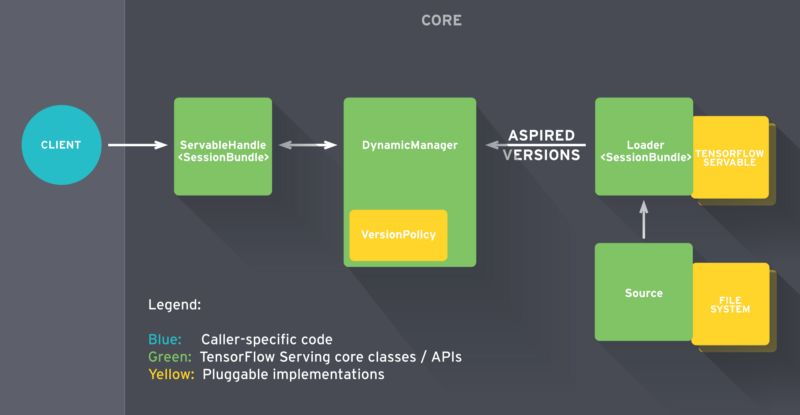
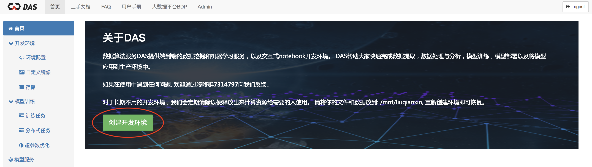

# 模型部署

[TOC]

## 参考文献

https://blog.csdn.net/yunqiinsight/article/details/88839595

https://blog.csdn.net/wc781708249/article/details/78596459

https://zhuanlan.zhihu.com/p/42905085

https://www.jianshu.com/p/675a31e135c1

https://cloud.tencent.com/developer/article/1435816

https://github.com/sthalles/deeplab_v3

https://git.lug.ustc.edu.cn/fsg/deeplearning/text-antispam/tree/master

https://docle.github.io/2019/04/06/Deploying-keras-models-using-tensorflow-serving-and-flask/

https://zhuanlan.zhihu.com/p/52096200

https://www.tensorflow.org/serving/

https://github.com/tensorflow/serving

https://cf.jd.com/display/AI/DAS+API#DASAPI-3%E3%80%81%E8%AE%AD%E7%BB%83%E6%A8%A1%E5%9E%8B

https://cf.jd.com/display/AI/serving

http://das.jd.com/api/docs/

## 方案是什么

### 方案一 Tensorflow Serving

Tensorflow Serving，是谷歌发布的一款工具，用于模型部署。

#### **TF.Server的工作流程**



TF Serving的工作流程主要分为以下几个步骤：

- Source组件负责发现模型文件，然后针对需要进行加载的模型创建一个Loader，Loader中会包含要加载模型的全部信息，包括如何加载模型如何估算模型需要的资源，包括需要请求的RAM、GPU内存。Loader带一个指针，连接到磁盘上存储的模型，其中包含加载模型需要的相关元数据。不过记住，Loader现在还不允许加载模型；
- Loader创建完成后，Source组件将其发送至Manager，作为一个待加载的版本；
- Manager通过版本管理策略（Version Policy）来确定哪些模型需要被下架，哪些模型需要被加载；
- Manger在确认需要加载的模型符合加载策略，便通知Loader来加载最新的模型；
- 客户端像服务端请求模型结果时，可以指定模型的版本，也可以使用最新模型的结果；


关键工作：导出TF Serving适合的模型、启动服务和生成客户端请求

**（1）导出TF Serving适合的模型（生成pb文件）**

将TensorFlow构建的模型用作服务，首先需要确保导出为正确的格式，可以采用TensorFlow提供的SavedModel类。SavedModel是TensorFlow模型的一种通用序列化格式。如果你熟悉TF，你会使用 TensorFlow Saver to persist保存模型变量。TensorFlow Saver提供模型checkpoint磁盘文件的保存/恢复。事实上SavedModel封装了TensorFlow Saver，对于模型服务是一种标准的导出方法。

SavedModel对象有一些不错的特性。首先，一个SavedModel对象中可存储一个或更多的meta-graph，换句话说，这个特性允许我们为不同的任务订制不同的计算图。例如模型训练完成后，大多数情况下使用推理模式时，计算图中不需要一些用于训练的特殊操作，包括优化器、学习率调度变量、额外的预处理操作等等。另外，有时候可能需要将计算图简化作移动端部署。


在这些场景下SavedModel允许用户以不同的配置保存计算图。本例中文件中会有三个不同的计算图，分别标签为“training”, “inference”和“mobile”。这三个计算图共享同一组变量—— 意味着内存使用效率更高。 不久以前，在移动设备上部署TF模型，需要为模型指定输入输出张量的名称。这个需求逼着程序员在整张计算图中寻找相应的张量。这种情况下，如果之前在计算图中变量未正确命名，这个过程就变得很繁琐了。 

**SavedModel提供了SignatureDefs**，简化了这一过程。SignatureDefs定义了一组TensorFlow支持的计算签名，便于在计算图中找到适合的输入输出张量。简单的说，使用这些计算签名，可以准确指定特定的输入输出节点。TF Serving要求模型中包含一个或多个SignatureDefs，以使用内建服务API。

开始建立签名。我们需要为签名定义指定输入输出和方法名这些参数。这里输入输出表示一个从字符串到TensorInfo对象的映射(后面会详细介绍)，定义了计算图中默认接收和输出的张量。方法名 参数指向一个TF高级服务API。**目前有3个服务API: 分类、预测和回归。每个签名定义关联一个RPC API。分类SignatureDef用于分类RPC API，预测SignatureDef用于RPC API等等**。对于分类SignatureDef，需要一个输入张量(接收数据)以及可能的输出张量: 类别和/或得分。回归SignatureDef需要一个输入张量以及另一个输出张量。最后预测SignatureDef需要一个可变长度的输入输出张量。此外，SavedModel支持在操作初始化依赖于外部文件的情况下存储资产。也包括在构建SavedModel之前清空设备。

**（2）启动模型服务**

执行以下命令：

```
tensorflow_model_server --port=9000 --model_name=deeplab --model_base_path=<full/path/to/serving/versions/>
```

model_base_path 指的是导出模型存储的位置，其中不需要指定版本，其版本控制由TF Serving控制

**（3）生成客户端请求**

首先读取将要发送给服务器的图片，将其处理转换成适当的格式。然后，建立一个gRPC stub，用以调用远程服务器上的方法。需要实例化prediction_service_pb2 模块中的beta_create_PredictionService_stub类。 这样stub就得到了远程调用所必须的逻辑，这一切就好像在本地执行一样。

此后，创建并设置请求对象。由于服务器实现TensorFlow预测API，需要解析预测请求。发送预测请求，首先需要从predict_pb2模块实例化一个PredictRequest类，还需要指定model_spec.name 以及 model_spec.signature_name 两个参数。这里name参数就是启动服务时候传入的 ‘model_name’ 参数，signature_name 指的是调用 add_meta_graph()时传入的 signature_def_map中的逻辑名。

然后，需要以预先定义的签名形式给服务器输入数据。记得么，在服务端之前定义的预测API，期望获得图像以及两个标量(图像的高度和宽度)。TensorFlow提供tf.make_tensor_proto()函数，用于装载输入数据到请求对象，该方法可从numpy或python对象处创建TensorProto对象。好了我们就用该方法构建请求对象，并填入图像和相关维度信息。看起来，现在我们已经准备好，可以调用服务器了。执行stub中Predict()方法传入请求对象作为参数。对于那些返回单一结果的请求，gRPC支持: 同步和异步两种调用。一般使用Predict()，如果希望请求被服务端处理时，本地仍然能处理一些工作，可以调用Predict.future() 。

#### 安装步骤

安装TensorFlow Serving有三种方法：docker，二进制，源码编译。

方案一：docker安装

1.准备tf serving的docker环境

```
docker pull tensorflow/serving
```

2.拉取源码，部署源码中的half_plus_two模型测试serving是否可用

```
git clone https://github.com/tensorflow/serving
cd serving

TESTDATA="$(pwd)/serving/tensorflow_serving/servables/tensorflow/testdata"
# 设置端口转发，以下两条命令都可以启动服务
docker run -dt -p 8501:8501 -v "$TESTDATA/saved_model_half_plus_two_cpu:/models/half_plus_two" -e MODEL_NAME=half_plus_two tensorflow/serving
docker run -d -p 8501:8501 --mounttype=bind,source=$TESTDATA/saved_model_half_plus_two_cpu/,target=/models/half_plus_two -e MODEL_NAME=half_plus_two -t --name testserver tensorflow/serving

# 在服务器本机测试模型是否正常工作，这里需要注意，源码中half_plus_two的模型版本是00000123，但在访问时也必须输入v1而不是v000000123
curl -d '{"instances": [1.0, 2.0, 5.0]}' -X POST http://localhost:6005/v1/models/half_plus_two:predict
# 得到{"predictions": [2.5, 3.0, 4.5]}这个结果说明模型部署成功
```

### 方案二 京东DAS API（需要使用指定的镜像）

Das api 是京东开发的支持端到端的数据处理，模型训练，模型部署以及在线预测的任务的框架，能够支持各种主流机器学习和深度学习框架，如Tensorflow(包括Keras), Pytorch, MxNet, Caffe, SkLearn, Xgboost, LightGBM等等。

#### 工作流程

1.创建开发环境

在开始构建你的数据算法代码之前，您需要创建一个开发环境，选择您需要的机器学习/深度学习框架，选择需要访问的集市数据。您的开发环境是完全托管的 Jupyter Notebook，您可以使用该笔记本高效地探索和显示您的数据及开发模型。



2.训练模型

（1）直接训练

首先，目录必须建立在 "/mnt/$YOUR_ERP/" 下，


（2）已有模型转换


3.模型部署


4.模型预测


## 方案是用来解决什么问题

tf.server方案主要用来解决tensorflow的模型部署问题


## 方案在什么场景下使用，效果如何

## 方案的优缺点是什么

## 方案的改进方案

## 面试问题