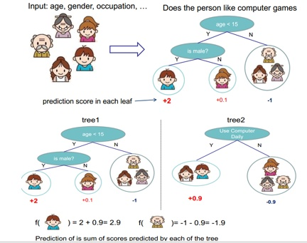

# 随机森林

[TOC]

## 参考文献

https://zhuanlan.zhihu.com/p/34534004?utm_source=wechat_session&utm_medium=social&utm_oi=1041629262821994496&from=singlemessage&isappinstalled=0&wechatShare=1&s_r=0

## 算法是什么

随机森林是一个典型的多个决策树的组合分类器。主要包括两个方面：数据的随机性选取，以及待选特征的随机选取。

（1）数据的随机选取：
第一，从原始的数据集中采取有放回的抽样（bootstrap），构造子数据集，子数据集的数据量是和原始数据集相同的。不同子数据集的元素可以重复，同一个子数据集中的元素也可以重复。
第二，利用子数据集来构建子决策树，将这个数据放到每个子决策树中，每个子决策树输出一个结果。最后，如果有了新的数据需要通过随机森林得到分类结果，就可以通过对子决策树的判断结果的投票，得到随机森林的输出结果了。如下图，假设随机森林中有3棵子决策树，2棵子树的分类结果是A类，1棵子树的分类结果是B类，那么随机森林的分类结果就是A类。

（2）、待选特征的随机选取：
与数据集的随机选取类似，随机森林中的子树的每一个分裂过程并未用到所有的待选特征，而是从所有的待选特征中随机选取一定的特征，之后再在随机选取的特征中选取最优的特征。这样能够使得随机森林中的决策树都能够彼此不同，提升系统的多样性，从而提升分类性能。

## 算法是用来解决什么问题

## 算法如何进行训练

## 算法在什么场景下使用，效果如何

## 算法的优缺点是什么

构建组合分类器的好处：

（1）提升模型精度：整合各个模型的分类结果，得到更合理的决策边界，减少整体错误，实现更好的分类效果；

（2）处理过大或过小的数据集：数据集较大时，可以将数据集划分成多个子集，对子集构建分类器；数据集较小时，可通过多种抽样方式（bootstrap）从原始数据集抽样产生多组不同的数据集，构建分类器。

（3）若决策边界过于复杂，则线性模型不能很好地描述真实情况。因此先对于特定区域的数据集，训练多个线性分类器，再将它们集成。

（4）比较适合处理多源异构数据（存储方式不同（关系型、非关系型），类别不同（时序型、离散型、连续型、网络结构数据））

## 算法的改进方案

## 面试问题